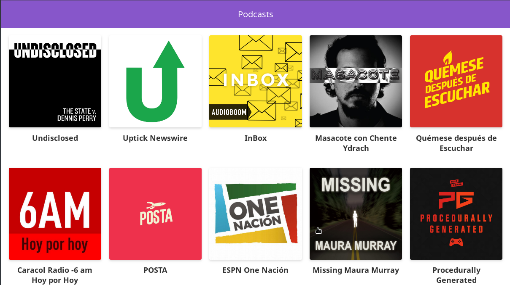
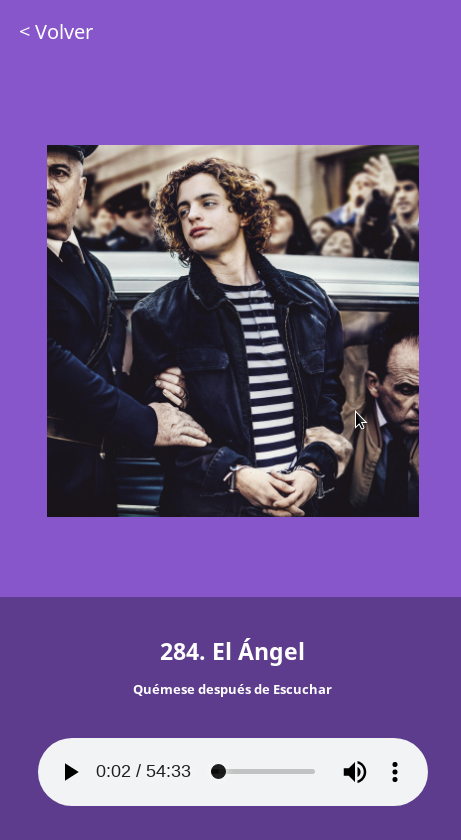

# Podcast App - Learning Next.js

This is an application to learn the basics of Next.js framework. This project have been done following the Next.js Platzi course [Live Deom](https://podcast-platzi-xnwvpnfbep.now.sh/).

## Requirements

- Node.js

## Running locally

From the project path run `npm install`

For Development:
`npm run dev`

For Production:
`npm run build && npm start`

## Screenshots

- 

- 

## PWA

As this page now works as a PWA you could install(Add to homescreen) in your device and use this offline. You can try it loading and caching data first and then set your device in airplane mode.
